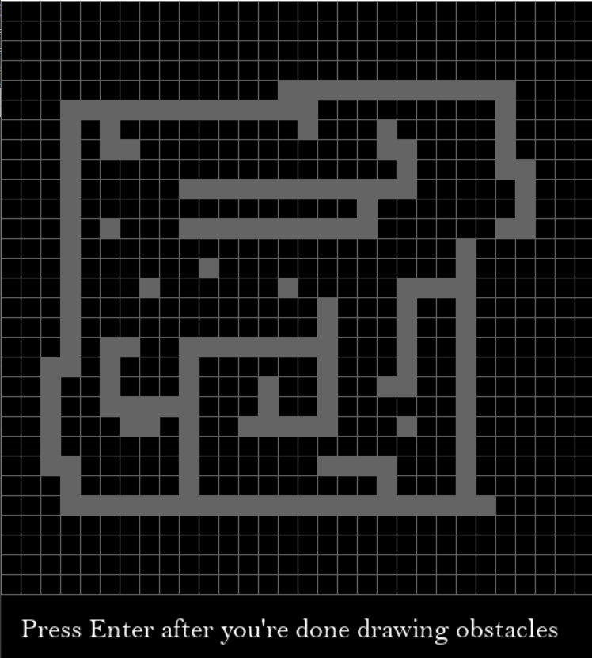
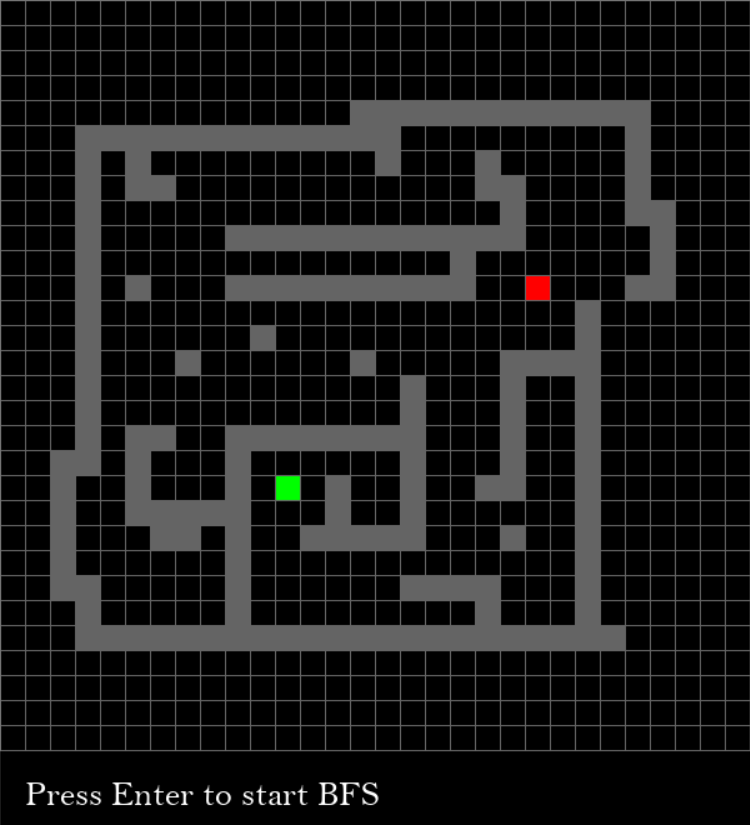
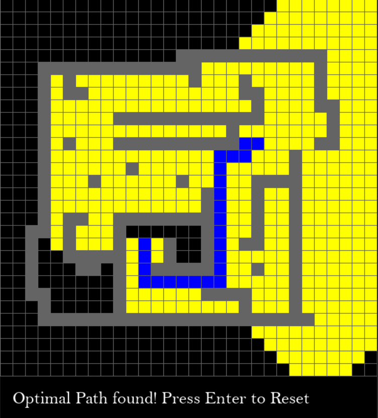

# Maze-Solver-BFS
Visualization of BFS while solving a custom-made maze using Python.

BFS or Breadth-First search is a graph traversal algorithm that starts traversing the graph from the root node and explores all the neighboring nodes. Then, it selects the nearest node and explores all the unexplored nodes.
BFS is complete and optimal i.e it can be used to find the optimal path between two nodes of any graph.

Requirements:
- python=3.7 or higher
- pygame=2.0.1

Here's how it looks:

- User can draw the maze/obstacles

- User can select the starting (red) and ending (green) points

- Watch BFS at work! The optimal path is highlighted in blue and the yellow squares show the nodes explored by the algorithm.

